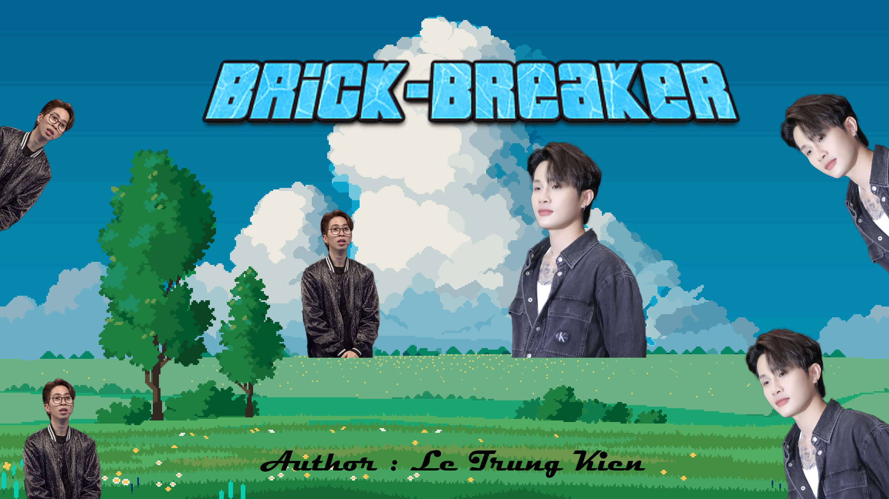
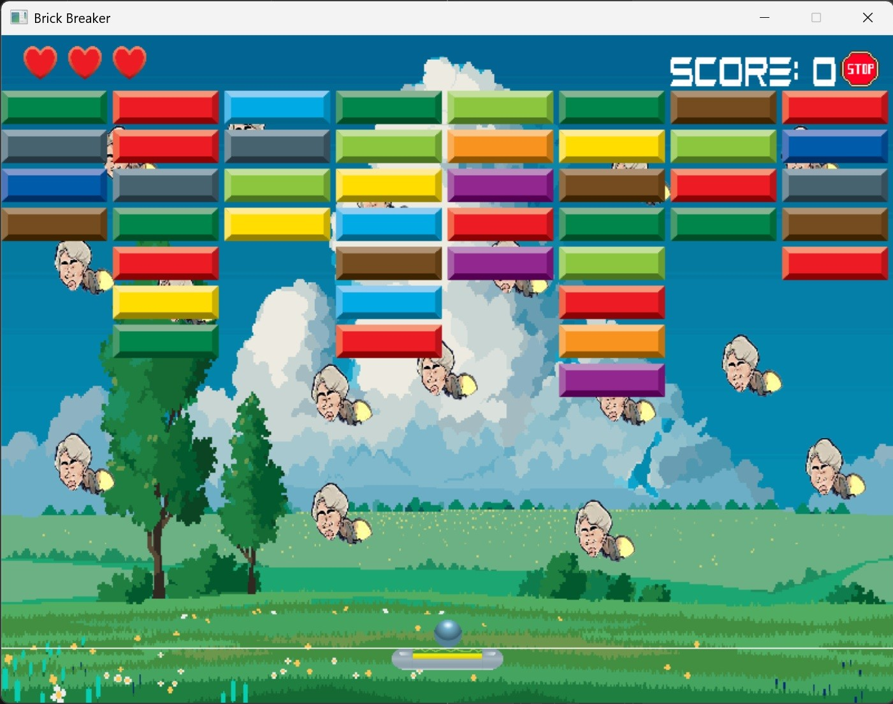
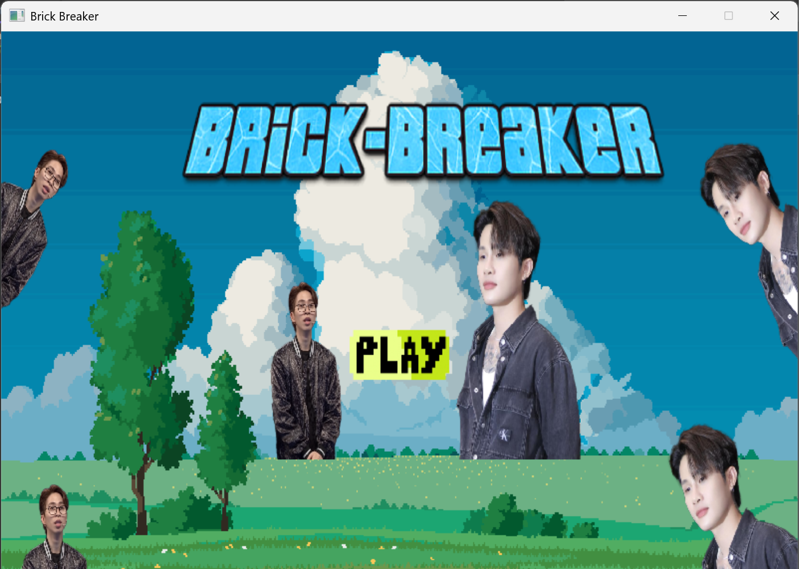
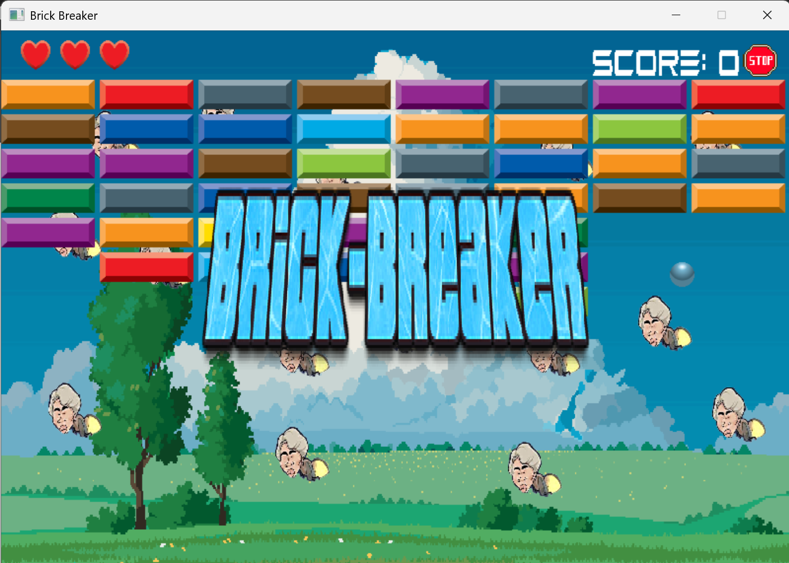
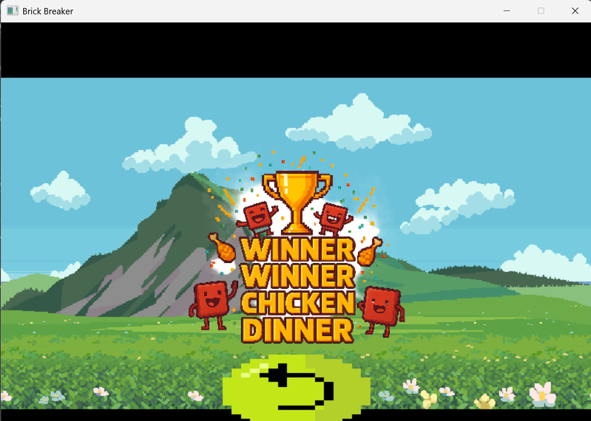
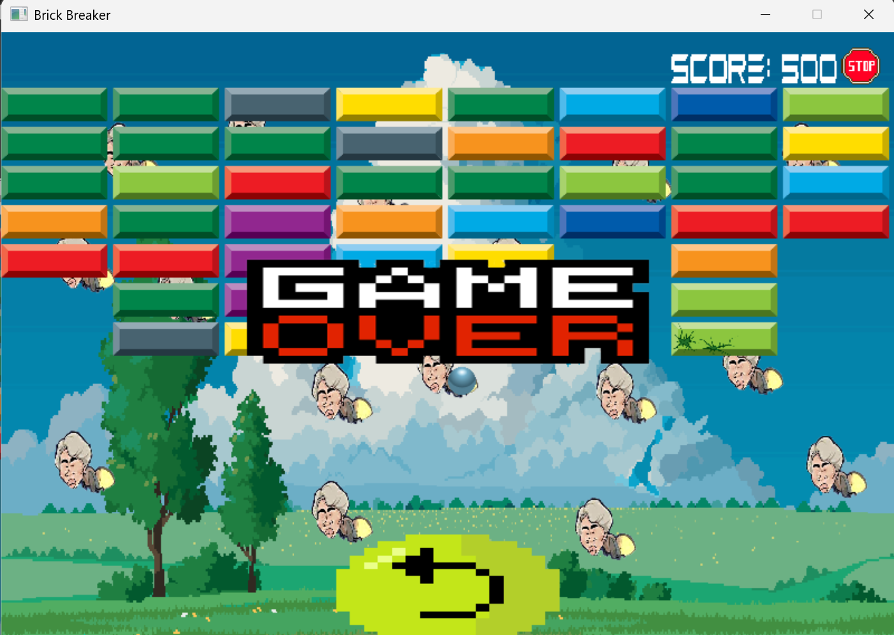

# Brick-Breaker : SDL2 C++ version

 <strong>Author</strong>: Lê Trung Kiên 

 <strong> Student ID </strong>: 24021539

- [A. Introduction](#A-introduction)
  * [Setup Enviroment](#1-Setup-Enviroment)
  * [Tutorial](#2-Tutorial)
- [B. Sources](#B-sources)
- [C. Conclusion](#C-conclusion)

# A. Introduction
Dưới đây là trò chơi mà em dành thời gian ra trong **6 tuần** và cũng là game đầu tiên mà em viết. Trò chơi này của em giúp giải trí sau những giờ làm việc căng thẳng , đồng thời tăng khả năng phản xạ của người chơi

Các thư viện đi kèm: **SDL2**, **SDL2-image**, **SDL2-ttf** và **SDL2-mixer**.

Đây là link video game : [Video](https://drive.google.com/file/d/1a69KRn6CZutNsCl55zkKRu9KXbMQ24YH/view?usp=sharing)

Game chạy bằng MSVC của Microsoft
# 1. Setup Enviroment
- Chạy file **GameBrickBreaker.exe** để chơi hoặc
- Sử dụng  các thư viện [SDL2](https://www.libsdl.org/) đi kèm để build file **game.cpp**. Chạy file vừa build được để chơi. 
# 2. Tutorial
- Tựa game sẽ có điểm mới lạ là nó sẽ tự động đùn gạch xuống phía dưới sau mỗi 8 giây nhằm tăng thêm tính thử thách

- Người chơi sẽ có 3 mạng , trước khi hết số mạng mà đạt được 10000 điểm thì sẽ chiến thắng . Nếu hết 3 mạng thì **thua** , hoặc để gạch đẩy xuống dưới vạch kẻ ngang paddle thì cũng xem như **thua**.

- Để bắt đầu , bạn cần ấn nút **play**. Sau đó nó sẽ hiện ra màn chơi , để chơi thì tiếp tục ấn **enter** , khi đó quả bóng sẽ rời khỏi paddle và bay theo logic trong game.

- Nếu thấy đang chán nản , bạn có thể **pause** bằng cách ấn **space** hoặc nút **Stop** góc phải màn hình.

- Khi chơi thì bạn có thể nghe được bài hát "Thiên lý ơi : của ca sĩ Jack J97, bên cạnh đó tựa game có xuất hiện nhiều khả năng hay ho của paddle cũng như là bóng : **nhân 3 bóng** , **tăng/giảm** tốc độ padđle/ bóng , **tàng hình** ,...
-   Khi thua thì bạn thì game sẽ hiện ra biểu tượng gameover và restart , bạn muốn chơi lại thì ấn vào restart. Còn nếu bạn thắng thì nó cũng sẽ tương tự khi thua , chỉ khác là load biểu tượng thắng

Khi thắng.

Khi thua.

# B. Sources
Game được em tự viết hoàn toàn với một số tham khảo từ:
- **Các dòng game brickbreaker như breakout hay arkanoid**.
- Cách làm việc với SDL từ **LazyFoo**.
- Một số thuật toán xử lý va chạm từ Internet và chatGPT.
- Nguồn ảnh độc đáo mới lạ của chatGPT và gemini.
- Âm thanh và một số hình ảnh lấy từ [pixabay](https://pixabay.com/).
- Font chữ được lấy từ trên mạng
# C. Conclusion
- Làm game là một việc rất thú vị , em từng chơi nhiều trò chơi nhưng khi bắt tay vào làm thì mới biết nó khó chừng nào . Trong quá trình làm game , em cũng đã được AI hỗ trợ rất nhiệt tình tiêu biểu như GPT , copilot , gemini . Đây là tựa game đầu tay của em , tuy nó còn nhiều thiếu sót , nhưng em vẫn sẽ lắng nghe ý kiến đọc góp của các bậc tiền bối để cải thiện hơn .
